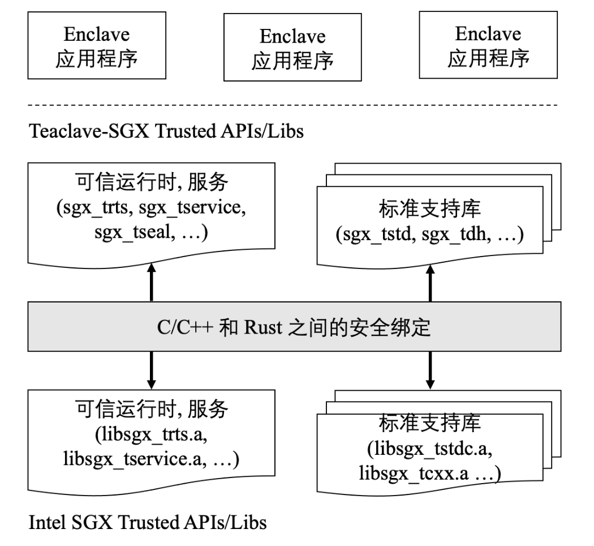
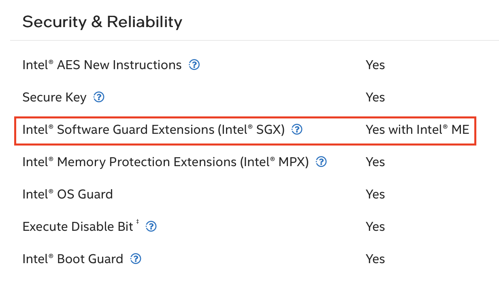

[[TOC]]


## Teaclave SGX SDK应用开发环境简介以及搭建

Intel SGX (Software Guard Extension, 软件防护扩展) 因为其较为出色的性能和安全性，是目前最为学术界和工业界关注的 TEE (Trusted Execution Environment, 可信执行环境)。Intel SGX 在内存中划分了名为 enclave（飞地）的隔离区域，用来存放敏感数据和代码。通过提供该隔离的可信执行环境，enclave 在操作系统、BIOS 和虚拟机监控器等系统软件均不可信的情况下，仍然对 enclave 内部的代码和数据提供保护，保障用户的关键数据和代码的机密性和完整性。

但如果 Intel SGX 程序仍然使用 C/C++ 这类内存不安全的语言开发的话，就会和传统软件一样面临着内存破坏漏洞的问题。对于 enclave 来说，受到的危害会更为严重，因为 enclave 中保存的多是机密数据和代码。Teaclave SGX 的主要目标就是通过使用高效的内存安全语言 —— Rust 来支持 enclave 应用程序的开发，从而在保证 Intel SGX enclave 内存安全的同时不会带来显著的性能开销。

Teaclave SGX SDK 内部结构分为三层：

+ 最底层是使用 C/C++ 和汇编实现的 Intel SGX SDK。
+ 中间层是 Rust 对 C/C++ 的 FFI (Foreign function Interfaces, 外部函数接口)。
+ 最高层是 Teaclave SGX SDK。



Teaclave SGX SDK 应用程序开发者在进行开发时就只需要基于最上层的 Teaclave SGX SDK 来进行开发，底层的实现对于开发者来说是透明的。本文将从开发者的角度介绍基于 Teaclave SGX SDK 开发自己的应用程序的过程。

### 准备条件

+ Ubuntu16.04 或者 18.04 或者 20.04 (Teaclave SGX SDK v1.1.3 中增加了对 Ubuntu 20.04 的支持)
+ docker 环境

*本文基于 Teaclave SGX SDK v1.1.3 提交哈希值：d107bd0718f723221750a4f2973451b386cbf9d2* 


### 基于 docker 配置 Teaclave SGX SDK 开发环境

首先需要用户机器 CPU 支持 Intel SGX 并且在 BIOS 上开启了 Intel SGX 支持。用户可以通过 [SGX-hardware项目](https://github.com/ayeks/SGX-hardware) 或者在 [Intel 官网](https://www.intel.com/content/www/us/en/products/details/processors.html) 中搜索自己的 CPU 型号查看是否支持 Intel SGX。下图以 Intel Core i7-7700K 处理器为例，如下图所示，该机型支持 SGX。



当确定 CPU 支持 Intel SGX 之后，还需要开启 BIOS 中的 SGX 选项。CPU 上的 SGX 选项可能有 `enabled` 或者 `software controlled`。具有 `enabled` 选项的主机直接在 BIOS 上选择 `enabled` 即可，而`software controlled` 表示 SGX 的开启需要由软件触发，还需通过 Intel 官方提供的 [sgx-software-enable](https://github.com/intel/sgx-software-enable) 开启。下载好 `sgx-software-enable` 之后，运行 `Makefile` 编译生成可执行代码 `sgx_enable` ，执行 `sudo ./sgx_enable` 顺利运行后重启主机，即可顺利开启 Intel SGX。 

硬件条件准备完毕之后，还需要安装 [Linux SGX 驱动](https://download.01.org/intel-sgx/sgx-linux/2.10/distro/ubuntu16.04-server/sgx_linux_x64_driver_2.6.0_602374c.bin)（本实验环境的操作系统版本为 ubuntu16.04 ，安装时需要根据自己的操作系统版本号在 [官网](https://download.01.org/intel-sgx/) 下载对应的 Intel SGX 驱动） ，安装完毕之后需要确认 `/dev/isgx` 的存在。

下载 Teaclave SGX SDK 以及支持编译 SGX 设备的 docker image。

`$ https://github.com/apache/incubator-teaclave-sgx-sdk`

`$ docker pull baiduxlab/sgx-rust`

启动一个 docker，并且把 Teaclave SGX SDK 项目目录映射到 docker 中。

`$ docker run -v /your/absolute/path/to/incubator-teaclave-sgx-sdk:/root/sgx -ti --device /dev/isgx baiduxlab/sgx-rust`

在运行的 docker container 中启动 aesm 服务，**White list update request successful for Version** 语句意味着启动成功。

````bash
root@docker:/# LD_LIBRARY_PATH=/opt/intel/sgx-aesm-service/aesm/ /opt/intel/sgx-aesm-service/aesm/aesm_service &
aesm_service[17]: [ADMIN]White List update requested
aesm_service[17]: Failed to load QE3: 0x4004
aesm_service[17]: The server sock is 0x56096ab991c0
aesm_service[17]: [ADMIN]White list update request successful for Version: 103
````

执行 Teaclave SGX SDK 中的简单实例 helloworld ，检查是否正常运行。

```bash
root@docker:~# cd sgx/samplecode/helloworld/
root@docker:~/sgx/samplecode/helloworld# make
root@docker:~/sgx/samplecode/helloworld# cd bin/
root@docker:~/sgx/samplecode/helloworld/bin# ./app
[+] global_eid: 2
This is normal world string passed into enclave!
This is a Rust string!
[+] say_something success ...
```
至此，我们已经成功在自己的机器上跑起来了 Teaclave SGX SDK 的 helloworld 示例啦！

## Teaclave SGX SDK 示例 helloworld 剖析

接下来，我们通过阅读 helloworld 这个简单的例子来理解 Teaclave SGX SDK 应用程序的组织结构和运行方式。

### helloworld 目录结构

```tree
helloworld/ 
├── app 
│   ├── app.c 
│   └── app.h 
├── bin 
│   └── readme.txt 
├── enclave 
│   ├── Cargo.toml 
│   ├── Enclave.config.xml 
│   ├── Enclave.edl 
│   ├── Enclave.lds 
│   ├── Enclave_private.pem 
│   ├── Makefile 
│   ├── src 
│   │   └── lib.rs 
│   ├── x86_64-unknown-linux-sgx.json 
│   └── Xargo.toml 
├── lib 
│   └── readme.txt 
└── Makefile 
```

helloworld 的目录结构和 Intel SGX 的 [SampleEnclave](https://github.com/intel/linux-sgx/blob/HEAD/SampleCode/SampleEnclave) 目录结构非常类似。
+ app 目录中存放的是不可信部分代码，包括 `main` 函数以及 `OCALL` 函数具体逻辑实现。
+ enclave 目录中存放的是可信部分代码，主要是 `ECALL` 函数具体逻辑实现。
    + 不同于 SGX ，应用安全区的代码实现位于 **`src/lib.rs`**, 该文件是整个 `helloworld` 文件夹中唯一使用 Rust 编写的文件，程序员可以在该文件中增加需要的功能。
    + 另外，enclave 文件夹下多了 `Cargo.toml`, `src/lib.rs`, `x86_64-unknown-linux-sgx.json`, `Xargo.toml`：
        + **`Cargo.toml`**: 项目清单文件，包括项目名称、项目版本以及依赖项等。
        + **`x86_64-unknown-linux-sgx.json`** 和 **`Xargo.toml`** 描述了用于项目交叉编译的信息。

### 重要代码文件解析

+ **`Enclave.edl`** \
该文件规定了 Enclave 边界 `ECALL/OCALL` 的定义。

```edl
enclave {
    from "sgx_tstd.edl" import *;
    from "sgx_stdio.edl" import *;
    from "sgx_backtrace.edl" import *;
    from "sgx_tstdc.edl" import *;

    trusted {
        /* define ECALLs here. */
        public sgx_status_t say_something([in, size=len] const uint8_t* some_string, size_t len);
    };

    untrusted {

    };
};
```

`trusted {...}` 中声明 `ECALL` 函数， `untrusted {...}` 中声明 `OCALL` 函数。本例中声明了一个 `ECALL` 函数 `say_something`，该函数的具体实现在 `src/lib.rs` 中，它的参数包括 `uint8_t *` 类型的指针和长度参数 `len`。

+ **`app/app.c`** 

在 `app/app.c` 的 `main` 函数中有一个完整的调用 `ECALL` 的例子。

```c
sgx_ret = say_something(global_eid,
                        &enclave_ret,
                        (const uint8_t *) str,
                        len);
```

这里的 `say_something` 似乎和 `Enclave.edl` 中的声明不太一样，ECALL传递参数时多了两个隐参数：`enclave_eid` 和 `say_something` 的返回值 `&enclave_ret`。而 `sgx_ret` 表示的是 ECALL 执行是否成功，是 SGX 的返回值。

+ **`enclave/`文件夹部分** 

`enclave/Cargo.toml` 中声明了这是一个 `staticlib`，表明 Enclave 在最后会被编译成一个 `.a` 文件，该文件会和 Intel 提供的 `sgx_tstdc.a` 等文件链接形成 `enclave.so`，再经由 `sgx_sign` 工具配合 `Enclave.config.xml` 配置文件、`Enclave_private.pem` 签名私钥做签名并计算 `measurement` ，最后生成 `enclave.signed.so`，这是 Enclave 的完全体。

+ **`enclave/src/lib.rs`** 

```rust
pub extern "C" fn say_something(some_string: *const u8, some_len: usize) -> sgx_status_t {

    let str_slice = unsafe { slice::from_raw_parts(some_string, some_len) };
    let _ = io::stdout().write(str_slice);

    // A sample &'static string
    let rust_raw_string = "This is a ";
    // An array
    let word:[u8;4] = [82, 117, 115, 116];
    // An vector
    let word_vec:Vec<u8> = vec![32, 115, 116, 114, 105, 110, 103, 33];

    // Construct a string from &'static string
    let mut hello_string = String::from(rust_raw_string);

    // Iterate on word array
    for c in word.iter() {
        hello_string.push(*c as char);
    }

    // Rust style convertion
    hello_string += String::from_utf8(word_vec).expect("Invalid UTF-8")
                                               .as_str();

    // Ocall to normal world for output
    println!("{}", &hello_string);

    sgx_status_t::SGX_SUCCESS
}
```
该函数实现了一个简单的将 `&[u8]` 数组转化为字符串输出的函数，注意在函数的最后调用的 `println!` 函数是一个 `OCALL`。 `println!` 的具体实现中加入了内置的 `OCALL`，并定义了内置的 `edl` ，import到了 `Enclave.edl` 中。 
```edl
enclave {
    from "sgx_tstd.edl" import *;
    from "sgx_stdio.edl" import *;
    from "sgx_backtrace.edl" import *;
    from "sgx_tstdc.edl" import *;
```


### 编译后的代码目录 
经过编译之后的代码目录如下所示，这里省略了 `release` 文件夹下的内容。
```tree
├── app 
│   ├── app.c 
│   ├── app.h 
│   ├── app.o               #[generate] 
│   ├── Enclave_u.c         #[generate] 
│   ├── Enclave_u.h         #[generate] 
│   └── Enclave_u.o         #[generate] 
├── bin 
│   ├── app                 #[generate] 
│   ├── enclave.signed.so   #[generate] 
│   └── readme.txt 
├── enclave 
│   ├── Cargo.lock          #[generate] 
│   ├── Cargo.toml 
│   ├── Enclave.config.xml 
│   ├── Enclave.edl 
│   ├── Enclave.lds 
│   ├── Enclave_private.pem 
│   ├── enclave.so          #[generate] 
│   ├── Enclave_t.c         #[generate] 
│   ├── Enclave_t.h         #[generate] 
│   ├── Enclave_t.o         #[generate] 
│   ├── Makefile 
│   ├── src 
│   │   └── lib.rs 
│   ├── target              #[generate] 
│   │   ├── CACHEDIR.TAG    #[generate] 
│   │   └── release         #[generate] 
│   ├── x86_64-unknown-linux-sgx.json 
│   └── Xargo.toml 
├── lib 
│   ├── libenclave.a        #[generate] 
│   ├── libsgx_ustdc.a      #[generate] 
│   └── readme.txt 
└── Makefile 
```
helloworld 编译的基本流程类似于 Intel SGX:
+ `edger8r` 将输入的 `EDL` 在 `app/` 目录下生成不可信代码 `Enclave_u.h` 和 `Enclave_u.c`；
+ 编译不可信部分生成 `bin/app`；
+ `edger8r` 在 `enclave/` 目录下生成可信代码 `Enclave_t.h` 和 `Enclave_t.c`；
+ 编译并签名生成可信动态链接库 `enclave.signed.so`。  

## 开发者如何开发自己的 Rust SGX Application
同样类似于开发 Intel SGX Application，用户可以通过改写 Teaclave SGX SDK 所提供的 `samplecode`，在这里，我以一个简单的例子抛砖引玉。

### 添加自定义的函数
假设用户希望在 Teaclave SGX SDK 中实现一个简单的求两个数组的交集的函数，只需要直接在 `src/lib.rs` 中添加实现的函数。下面的示例代码 `intersection` 函数是希望添加的求交集函数，注意这里求到的交集结果是无重复元素的。传入的两个参数是需要求交集的 `i32` 向量，最后返回的是两个向量的交集。其具体的实现是通过一个额外的散列集，记录 `num1` 出现的元素，再对 `num2` 进行遍历，如果 `num2` 出现了散列集中的元素，则将该值 `push` 到交集数组中，并将散列表中的对应元素移除。当 `num2` 遍历完毕之后，返回交集数组。

```rust
pub fn intersection(nums1: Vec<i32>, nums2: Vec<i32>) -> Vec<i32> {
        use std::collections::HashSet;
        let mut set: HashSet<i32> = HashSet::new();
        let mut vec: Vec<i32> = Vec::new();

        for i in nums1.iter() {
            set.insert(*i);
        }

        for i in nums2.iter() {
            if set.contains(i) {
                vec.push(*i);
                set.remove(i);
            }
        }
        return vec;
    }
```

考虑一个比较现实的场景，两个用户分别将自己的向量作为参数传入 enclave 中进行计算，这时候数据需要从不可信代码区域复制到可信代码区域。
首先，需要在 `Enclave.edl` 文件中修改 `say_something` 函数的定义，输入参数为两个用户的向量指针以及对应的向量大小。
```edl
public sgx_status_t say_something([in, size=len1] size_t* num1, size_t len1,
                                  [in, size=len2] size_t* num2, size_t len2);
```

接着，在 `app.c` 文件中声明需要求交集的数组以及大小并仿照示例调用 `say_something`。 

```c
    size_t nums1[10] = {0,1,2,3,4,5,6,7,8,9};
    size_t nums2[10] = {5,6,7,8,9,10,11,12,13,14};
    size_t len1 = sizeof(nums1);
    size_t len2 = sizeof(nums2);

    sgx_ret = say_something(global_eid, 
                            &enclave_ret,
                            nums1,
                            len1,
                            nums2,
                            len2);
```

回到 `enclave/src/lib.rs`，`say_something` 传进来的是两个向量的起始地址以及大小。
```rust
pub extern "C" fn say_something(nums1: *mut usize, len1: usize, nums2: *mut usize, len2: usize) -> sgx_status_t 
```
由于数据是从非安全区复制到安全区的，还需要对 `intersection` 函数进行部分改写。传进来的参数是数组指针，以指针地址为起始地址，根据大小参数限制迭代范围并获得一个用于循环的序号变量 `i`，在 `for` 循环中使用 `offset` 偏移指针，解引用它，读出 `nums1` 和 `nums2` 的元素值。

```rust
pub fn intersection(nums1: *mut usize, len1: usize, nums2: *mut usize, len2: usize) -> Vec<usize> {
    use std::collections::HashSet;
    let mut set: HashSet<usize> = HashSet::new();
    let mut vec: Vec<usize> = Vec::new();

    for i in 0..len1/mem::size_of::<usize>() {
        let mut val_nums1 = 0;
        unsafe {
            val_nums1 = *nums1.offset(i as isize);
        }
        set.insert(val_nums1); 
    }
    
    for i in 0..len2/mem::size_of::<usize>() {
        let mut val_nums2 = 0;
        unsafe {
            val_nums2 = *nums2.offset(i as isize);
        }
        if set.contains(&val_nums2) {
            vec.push(val_nums2);
            set.remove(&val_nums2);
        }
    }
    return vec;
}
```

完整的 `say_something` 函数如下所示。

```rust
#[no_mangle]
pub extern "C" fn say_something(nums1: *mut usize, len1: usize, nums2: *mut usize, len2: usize) -> sgx_status_t {
    let vec: Vec<usize> = intersection(nums1, len1, nums2, len2); 
    println!("intersection set is {:?}", vec);
    sgx_status_t::SGX_SUCCESS
}
```

重新编译并运行，得到运行结果：
```bash
[+] global_eid: 2
intersection set is [5, 6, 7, 8, 9]
[+] say_something success ...
```
我们基于 Teaclave SGX SDK 的 helloworld 实现了自己的求交集函数。

### 调用 Teaclave SGX SDK 提供的 `crate`

Teaclave SGX SDK 重写了很多 SGX 的库，当我们需要用某个库时，可以先在仓库中查看是否有相应的 `crate` 实现以及对应的 [doc](https://teaclave.apache.org/api-docs/crates-enclave/)。比如当我们希望生成一个随机数时，在 `C++` 或者 `Rust` 环境下，会想到使用 `rand` 库。自然而然地，Teaclave SGX SDK 也用 Rust 重写了 [`sgx_rand`](https://github.com/apache/incubator-teaclave-sgx-sdk/tree/master/sgx_rand) 库。 

首先在 `enclave/Cargo.toml` 中的 `[target.'cfg(not(target_env = "sgx"))'.dependencies]` 部分添加 `sgx_rand` 库的地址。

```toml
[target.'cfg(not(target_env = "sgx"))'.dependencies]
sgx_rand = {git = "https://github.com/apache/teaclave-sgx-sdk.git" }
```

现在万事俱备，只欠调用。回到 `lib.rs` 文件中，链接到 `sgx_rand` `crate`，导入其中的所有项，声明需要使用的模块。

```rust
extern crate sgx_rand;
use sgx_rand::Rng;
use sgx_rand::os::SgxRng;
```

调用 `gen_range` 函数生成 0-10 之间的随机数。

```rust 
let random = rng.gen_range(0, 10);
```

这样就可以在 Teaclave SGX SDK 中的 enclave 中通过调用官方 `crate` 随机生成一个随机数。

## 总结
本文首先介绍了 Teaclave SGX SDK 项目的基本结构，然后以 `helloworld` 为例子，介绍了一个简单的 Teaclave SGX SDK 的示例的组织结构和编译过程，最后，以在 `helloworld` 中实现 `intersection` 函数为例，介绍了如何基于提供的 SampleCode 进行 Teaclave SGX SDK 应用程序的开发。


## 延伸阅读
+ [一份主观的 SGX 导读：运行第一个 SGX 程序](https://github.com/dingelish/SGXfail/blob/master/01.md)
+ [Teaclave 官网](http://teaclave.apache.org)
+ [Teaclave SGX SDK 项目论文：《Towards Memory Safe Enclave Programming with Rust-SGX》](https://dl.acm.org/citation.cfm?id=3354241)
